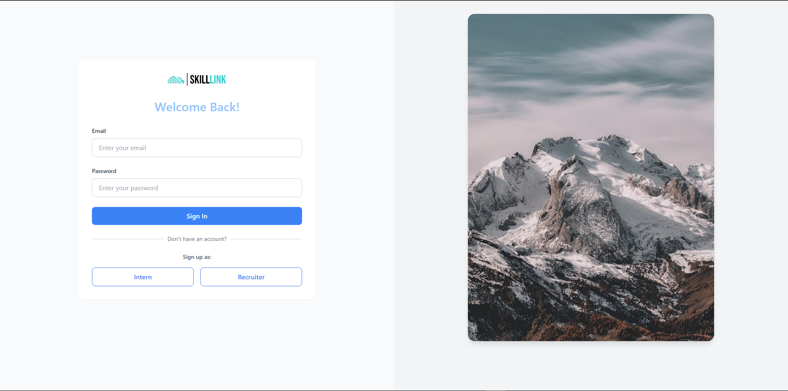
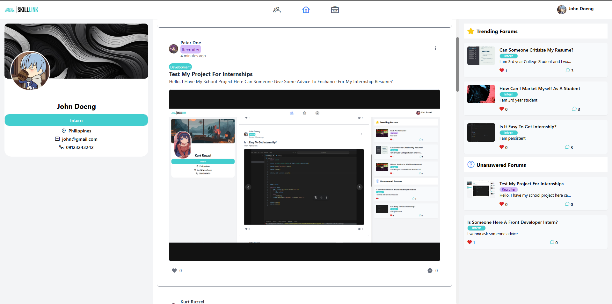

# SkillLink


SkillLink is an online community and knowledge-sharing hub where interns and recruiters can 
discuss industry trends, exchange career advice, and connect. This platform enhances the 
social experience for both roles by offering a dedicated space for meaningful interactions and 
professional networking.

## 📌 Screenshots

### 🔐 Login Page


### 📝 Sign-up Page


### 🌐 Main Dashboard


## 🚀 Getting Started

This project was generated using [Angular CLI](https://github.com/angular/angular-cli) version **19.0.7**.

### 🔧 Prerequisites
Make sure you have the following installed:
- [Node.js](https://nodejs.org/) (Latest LTS recommended)
- [Angular CLI](https://angular.dev/tools/cli) 

### 📥 Installation
Clone the repository and install dependencies:
```bash
git clone https://github.com/your-username/skilllink.git
cd skilllink
npm install
```

## 🎯 Development

### 🖥️ Start the Development Server
Run the following command to launch a local development server:
```bash
ng serve
```
Then, open your browser and navigate to [`http://localhost:4200/`](http://localhost:4200/). The app will automatically reload when you modify any source files.

### 📦 Code Scaffolding
Use the Angular CLI to generate new components, directives, or services:
```bash
ng generate component component-name
```
To see all available schematics, run:
```bash
ng generate --help
```

## 📦 Building the Project

To create a production-ready build, run:
```bash
ng build --configuration production
```
This compiles the project and places the optimized files in the `dist/` directory.

## 🧪 Running Tests

### ✅ Unit Tests
To run unit tests with [Karma](https://karma-runner.github.io):
```bash
ng test
```

### 🔍 End-to-End Tests
For e2e testing, use:
```bash
ng e2e
```
> Note: Angular CLI does not include an e2e framework by default. Choose a suitable framework like Cypress or Playwright.

## 📚 Additional Resources
- [Angular CLI Documentation](https://angular.dev/tools/cli)
- [Angular Official Guide](https://angular.dev/)
- [RxJS](https://rxjs.dev/)

---
👨‍💻 Developed with ❤️ by **Your Name**

